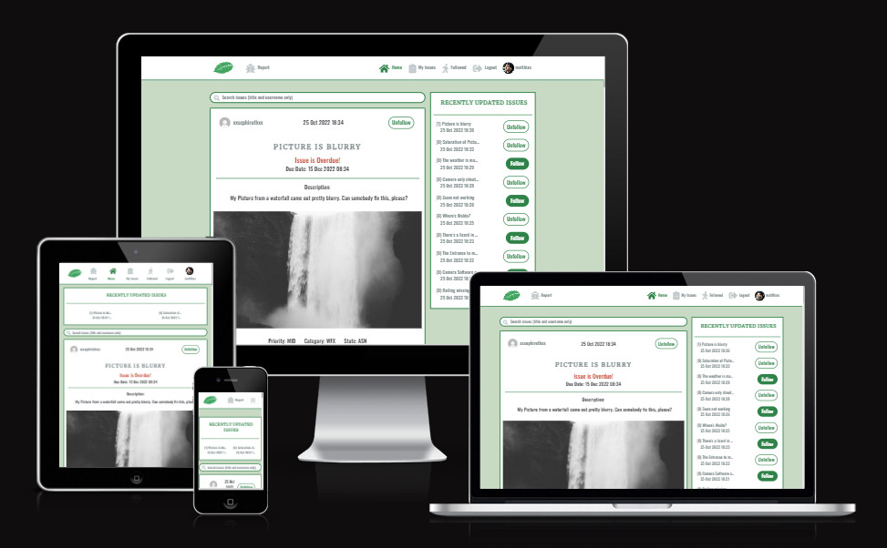

<h1 align="center"><a name="top">Project Peppermint</a></h1>

[View the live project here.](https://peppermint-qa.herokuapp.com/)

Project Peppermint is a Website that allows you to create Issues (also commonly referred to as Bug reports) and share them with other people. Authenticated users can create issues, update, and delete them. All Information is saved on an external API, which also tracks any modifications down to Events via its Journal model. 

Users can Browse and Search all Issues on the site and follow them, to more easily be updated on any changes to them. In addition, there is a box with the recent updated Issues that lets them easily see which issues were created/updated last and how many updates it has.

Contrary to my other Projects, this website is meant as an Intranet application, because of the nature of the shared information.

<h2 align="center"></h2>

 

## <a name="tableofcontents">Table of Contents</a>

### I. [User Experience (UX)](#userxp)
-   [Five Planes of UXD](#fiveplanes)
-   [Design](#design)
-   [User Stories](#userstories)
-   [Agile Methodology](#agile)
-   [Wireframes](#wireframes)

### II. [The Model](#databasemodel)

### III. [Features](#features)

### IV. [Technologies Used](#technology)

### V. [Testing](#testing)

### VI. [Future Features](#future)

### VII. [Deployment](#deployment)

### VIII. [Credits](#credits)

  

## ([^](#tableofcontents)) <a name="userxp">User Experience (UX)</a>

## <a name="userxp">User Experience (UX)]</a>

*   ### <a name="fiveplanes">Five Planes of UXD</a>
    -   #### Strategy Plane
        1. I've been working as a Customer Support Agent for 16 years and during that time I have come across a couple of different bug report/management systems. Most of them are overly complicated to use, so I wanted to create one that is more intuitive but still retains most of the functionality.
        2. Many companies do not need the bigger QA systems that are used with hundreds of features. A smaller lightweight application that is more fit for their needs will match their infrastructure better and reduce additional costs.
        3. Split between Frontend and Backend: By using an API, features can be implemented on the Backend and tested, without affecting Frontend functionality. This also makes it easier to split the development into different Teams, e.g. a Frontend and a Backend Team.
        4. Expandability: React is highly modular and can be easily expanded. If there is any need for more Features in the Future, they can be implemented without affecting the other components of the application. This also creates a situation where Teams working on the Frontend can be split further, each working on different components.
 
    -   #### Scope Plane
        1. The Site covers Authentication and CRUD around the Events as well as flagging an event for attendance.
        2. Actions done by the User like logging in or out will trigger Feedback Messages.
        3. The same is true for creating, deleting, modifying, and joining/leaving an Event.
        4. The Page 'My Events' is there to keep track of Events created by the User and Events he has joined so far as well as having easy access to deleting or modifying them.
        5. 'Browse Event' is there to show created Events and filter them by category, if they are online/offline, and/or if the Title, Summary, or Location contains a certain text the User defines.

    -   #### Structure Plane
        1. The Structure of the Site is simple and mostly linear. Progressing is mostly done with just the click of a Button unless form Inputs are required. The site visitor can always click on the navbar Elements to quickly find or create events. Only when watching event details or modifying an event, an additional step is needed.
        2. There is a clear indication on the Navbar when you are on one of it mentioned Pages. The only exceptions are 'detail' and 'modify' event pages because these require a specific event ID. However, these are straightforward and the site visitor can return to the normal navigation simply by clicking on one of the navbar elements.
    
    -   #### Skeleton Plane
        1. The [Wireframes](#wireframes) can be found further down in this Document.
        2. The Home Page is presented with a carousel, alternating images, and some basic information that gets the visitor interested. Further down more images with more pieces of information are implemented, finishing with a small list of upcoming events and a signup Button (only visible if the Site visitor is not already logged in). The Home Page is also the only site that contains images, while the other sites focus on Information display only.
        3. Events are implemented as Cards throughout the whole page, being introduced on the Home Page and then followed up in My Events and Browse.
        4. Forms are used for creating and modifying events as well as Filtering them in the Browse section on the Page. Crispy forms are used to make them fit with the Design of the Site.
        5. On mobile devices, the amount of content displayed next to each other changes to give users the chance to use the page with 100% functionality on these devices as well. The content is then ordered in a way he would normally consume the content on a Desktop Browser as well, to not cause confusion and keep it well structured. This is achieved by using Bootstrap 5.

    -   #### Surface Plane
        1. Fontawesome was used for the navbar, footer links, and event cards to display if you are the creator of that event or have joined it. Comparable Icons are used on other sites so this should feel familiar to the visitor.
        2. Further details like Font/Color choice, etc. can be found in the next separate Section: [Design](#design).

 

*   ### <a name="design">Design</a>
  
    -   #### Colour Scheme
        -   I choose a blueish color palette with a flashy red for highlighting links that are not buttons. The Palette can be found [here](https://coolors.co/9f141f-f1faee-a8dadc-457b9d-1d3557). The Font Color used is a Prussian Blue (#1D3557) while the background is not a clean white, but a variation of it called Honeydew (#F1FAEE). For the navbar, Powder Blue was my choice (#A8DADC) so that the contrast to both the Font Color as well as the Link Highlight in Ruby Red (#9F141F) meets WCAG compliance. The Footer swaps the colors around, taking the Site's Font color as its background and the Background color as its font color.
        -   To round up the color usage, the remaining blue color of the palette is Celadon Blue (#457B9D), which is between the Prussian Blue of the font and the Powder Blue of the navbar, and is used for the buttons on the website, the only exception being the reset button on the webform for creating an event to have some visual distinction there.
    
     
    <h2></h2> 

    -   #### Typography
        -   The Aleo font is used as the main font for the whole website with a serif as a backup font in case the font doesn't import correctly. It is also displayed in italic and bold, which makes it easy to read on all devices.
        -   To complement this, Arimo is used as the main header font. Its main purpose is to support the site's theme. The backup font is sans-serif.
  
    -   #### Imagery
        -   Only the Home Page contains any imagery. There is a big carousel showing multiple people taking part in events to associate the Site with the end goal of having fun together with other people. Further down the Homepage, we see 3 more images that show people creating and sharing an event, as well as one picture of a big event taking part at night with lots of lighting.
        
  
 

*   ### <a name="userstories">User stories</a>

    -   #### Site User

        1. As a Site User, I can register an account so that I can create/join and view details of events.
        2. As a registered Site User, I can log in and log out so that I can use the main features of the Site while seeing my logged-in Username.
        3. As a registered Site User, I can create my events so that I can share them with other site users.
        4. As a registered Site User, and Event Creator I can delete my existing events so that I can remove them from the website.
        5. As a registered Site User, and Event Creator I can edit/modify my existing events so that I can update their information.
        6. As a registered Site User, I can view and browse Events so that I can find out more information about them.
        7. As a registered Site User, I can join events so that I can show that I will attend these.
        8. As a registered Site User, I can leave events I have joined before so that I can show that I will no longer attend said event.
        9. As a registered Site User, I can search for events so that I can find events I want to join.
        10. As a registered Site User, I can quickly and easily distinguish Events I have created or joined in a list so that I can more easily find new events I am not involved with yet.
        11. As a registered Site user, I can see Feedback Messages about my Actions so that I receive a visual confirmation, that my action was successful.

    -   #### Site Admin

        1. As a Site Admin, I can create, read, update and delete events and their attendees so that I can manage the event site's content.

 

*   ### <a name="agile">Agile Methodology</a>

    - The Development of this project was managed using GitHub Projects.
        1. [The Project](https://github.com/Mycrosys/portfolio-project-4-tomodachi/projects/1)
        2. [Epics](https://github.com/Mycrosys/portfolio-project-4-tomodachi/issues?q=label%3Aepic)
        3. [User Stories](https://github.com/Mycrosys/portfolio-project-4-tomodachi/issues?q=label%3Auser-story)
        4. [Tasks](https://github.com/Mycrosys/portfolio-project-4-tomodachi/issues?q=label%3Atask)
    - Each Epic has the related User Stories written in its description. Likewise, User Stories have their related Tasks written in their comments.
    - The Backlog Tab in the Project contains Features that may be implemented in a future iteration of the development cycle. More about them can be found in the section [Future Features](#future) in this readme.

 

*   ### <a name="wireframes">Wireframes</a>
    -   Index Page Wireframe 1
        <h2></h2> 
    -   Index Page Wireframe 2
        <h2></h2> 
    -   Index Page Wireframe 3
        <h2></h2> 
    -   Register Account Wireframe
        <h2></h2> 
    -   Sign In Wireframe
        <h2></h2> 
    -   Sign Out Wireframe
        <h2></h2> 
    -   My Events Wireframe
        <h2></h2> 
    -   My Events Wireframe Mobile
        <h2></h2> 
    -   Delete Confirmation in My Events Wireframe
        <h2></h2> 
    -   Create Event Wireframe
        <h2></h2> 
    -   Browse Event Wireframe
        <h2></h2> 
    
  

## ([^](#tableofcontents)) <a name="databasemodel">The Event Database Model</a>

<h2></h2> 

- I decided on a simple Model for my first project to get it started. Allauth handles all Authentication Issues while my Event Model contains all relevant information about an event.

- Title, Summary, and Location_Area are Charfield/Textfields and are the most important Fields for a User to describe their Event. The Title will be visible on all cards throughout the Webpage, while the Summary and Location_Area can only be viewed on the Details Page. The summary contains the main event Description while Location_Area contains the meetup place, which can either be a physical address, or a link to another website, video service, or tool used.

- Location_Online tracks if the Event is an Offline Event (False), with people having to physically attend said event, or an Online Event (True), in which case people meet up on websites, voice, or video services, and the like. This is also only shown on the Detail Page, however, people can filter these Events on the Browse Page if they are looking specifically for one or the other.

- Created_On, Modified_On, and Location_Time are DateTimeFields. While Created on automatically tracks the creation time of the event, Modified_On tracks the time of the last modification. Both of them are only visible on the Details Page. Location_Time however is visible in all cards, because it tracks the time the event is taking place and is the most important information out of the three in most cases.

- Category tracks the category of the Event. There are currently 5 Possible categories: DIN (Dining), CIN (Cinema), GAM (Gaming), SPO (Sports), and CAM (Camping). For this first version of the Page, these categories are Hardcoded and limited to five, however, this is a place to further improve on the project, having a separate category model that lets the admin add new categories on the fly in another iteration of the Development cycle. The category is a piece of very important information for a Site User and every Card immediately shows its Category with a color Coded Background at the top of it.

- Author and Attendees track the Creator of the Event as well as the people that have joined it, confirming their attendance. The Author is shown on the Details Page, while the number of attendees is shown on every card, to see how popular a said event is. The Usernames of the people that joined are not shown anywhere on the normal page. Only the Admin will have access to this information on the admin panel due to possible privacy concerns. We don't want people to be stalked, so I limited the display for the moment. A future iteration may introduce both the display of users to the event creator, as well as granting the event creator the right to remove Attendees from their event.

- An earlier version used a slug, created from the title, but that was proven as being not effective because titles are probably being reused a lot in this scenario. Instead, the Event ID is now being used to link up pages.

  

## ([^](#tableofcontents)) <a name="features">Features</a>

###   Authentication

- Allauth handles all Authentication on the Website. Most of the Pages (details, my events, create/modify events, browse) require the User to be authenticated to work. If the User is not Authenticated, many elements of the Website aren't available, e.g. the Navbar does not even show some Pages, to begin with. If a User however uses a valid link to enter one of these pages, he will be met with a message telling him that he needs to be logged in and redirected to the home page a couple of seconds later. On the other side, if a user is authenticated, other elements are not shown. For example, neither the Login nor Register button is available, but instead, a logout option, as well as the username, is displayed. Likewise, the signup button on the bottom of the index page vanishes, if the user is logged in.

The Navbar with a logged-in User.
<h2></h2> 
The message tells you to log in or register.
<h2></h2> 

###   Color Coded display of Events, Information Icons

- Events are shown as Cards on the Website, with their Category having a unique background color to make it immediately recognizable which kind of Event the Site User is looking at. In addition, as a logged-in User, these cards do contain symbols showing if you are the creator of the event (A Calendar Icon will appear) or have confirmed your attendance for that Event already (A checkmark Icon will be shown). Both are implemented via Fontawesome.

<h2></h2> 

###   Event Creation/Modification and Deletion

- Registered Site Users can create their own events as well as modify or delete them. For easier access to created events, my events page exists, showing all events that the user created and have not already taken place (expired events are not shown anywhere on the page). In case of a deletion of an Event, a confirmation modal is being shown that asks for confirmation. Deleting an Event has non-reversible repercussions because while you may be able to create the event again, all attendees need to join that new event again by themselves. If you want your Event to keep its attendees, modifying instead of deleting and recreating it is recommended.

<h2></h2> 

- Event Creation and Modification are limited to give people time to adjust to attend or adjust to the changes. An event needs to be created at least 12 hours before it is taking place. The same holds true if you want to modify an event. In case the starting time is closer than 12 hours, you will be prompted to update the Location Time when modifying your event.

<h2></h2> 

###   Joining or Leaving Events and tracking of Attendees

- Registered Site Users are able to show their attendance by joining an Event. They can also leave it at any time, with no restrictions set in place. At this time, their name will not be visible to anyone except the admin in the admin panel for privacy reasons. This may change in future iterations of the project to give more control to the Event creator to manage the attendees.

- Event Creators can not join or leave their created events. Their attendance is required and they are added as an attendee upon creation of the event. In order for them to leave their event, they will need to delete it completely. This is so Event Creators take ownership of their events and not create them and let attendees handle everything around them.

<h2></h2> 

###   Visual Feedback to User Actions

- The Site gives Users visual Feedback on where they are and if their mouse is over a link that will cause an action like submitting a form, resetting it, filtering events, or changing the site they currently are on. In addition, actions like logging in, logging out, deleting/modifying an event or joining, or leaving it, will create a feedback message that will be shown for a couple of seconds on top of the screen.

Hovering over the Delete Button with the mouse. 
<h2></h2> 
Hovering over the Browse Navbar Link with the mouse while on the My Events Page. 
<h2></h2> 
Confirmation message after modifying an event. 
<h2></h2> 
 

## ([^](#tableofcontents)) <a name="technology">Technologies Used</a>

### Languages Used

-   [HTML 5](https://en.wikipedia.org/wiki/HTML/)
-   [CSS 3](https://en.wikipedia.org/wiki/CSS)
-   [JavaScript](https://de.wikipedia.org/wiki/JavaScript)
-   [Python](https://en.wikipedia.org/wiki/Python_(programming_language))
-   [Django](https://de.wikipedia.org/wiki/Django_(Framework))

### Django Packages Used

1. [Dj_database_url](https://pypi.org/project/dj-database-url/)
    - For parsing the URL from env.py
1. [Psycopg2](https://pypi.org/project/psycopg2/)
    - As a PostgreSQL database adapter for the Python
1. [Gunicorn](https://gunicorn.org/)
    - As the Heroku Server
1. [Allauth](https://django-allauth.readthedocs.io/en/latest/installation.html)
    - For Authentication (Signup, Login, Logout)
1. [Summernote](https://summernote.org/)
    - For the Filtering and WYSIWYG Editor in the Admin Panel
1. [Cloudinary](https://cloudinary.com/)
    - As a host for static and media files
1. [Crispy Forms](https://django-crispy-forms.readthedocs.io/en/latest/)
    - For styling login, register, create an event, modify an event and browse filter forms
1. [Crispy Bootstrap5](https://github.com/django-crispy-forms/crispy-bootstrap5)
    - To make Crispy Forms work together with Bootstrap 5
1. [Coverage](https://pypi.org/project/coverage/)
    - To generate a report of the code coverage of automatic tests

### Frameworks, Libraries & Programs Used

1. [Code Institute Basic Template:](https://github.com/Code-Institute-Org/gitpod-full-template)
    - This Template was used as a requirement for this Project.
1. [Git](https://git-scm.com/)
    - Git was used for version control by utilizing the Gitpod terminal to commit to Git and Push to GitHub.
1. [GitHub:](https://github.com/)
    - GitHub is used to store the project's code after being pushed from Git.
1. [Google Fonts:](https://fonts.google.com/)
    - Google fonts were used to import the 'Aleo' and 'Arimo' fonts into the style.css file.
1. [Font Awesome:](https://fontawesome.com/)
    - Font Awesome was used to add icons for aesthetic and UX purposes.
1. [Bootstrap](https://getbootstrap.com/)
    - Used to make the Website responsive and style it.
1. [Jquery](https://jquery.com/)
    - To help with Javascript
1. [Heroku](https://www.heroku.com/)
    - For deployment of the Project
1. [PostgreSQL](https://www.postgresql.org/)
    - As the Database used for the project.
1. [Balsamiq](https://balsamiq.com/)
    - Balsamiq was used to create [Wireframes](#wireframes) for the project.
1. [Gimp:](https://www.gimp.org/)
    - Gimp was used to create, modify and resize all images on this website.
1. [Favicon Generator](https://favicon.io/favicon-generator/)
    - Favicon Generator was used to create the Favicon for the project.
1. [W3C - HTML](https://validator.w3.org/)
    - For validating the HTML code
1. [W3C - CSS](https://jigsaw.w3.org/css-validator/)
    - For validating the CSS Code
1. [JSHINT - JS](https://jshint.com/)
    - For validating the JS Code
1. [PEP8](http://pep8online.com/)
    - For validating the Python code
1. [a11y](https://color.a11y.com/Contrast/)
    - For validating the contrast of colors used on the Website

 