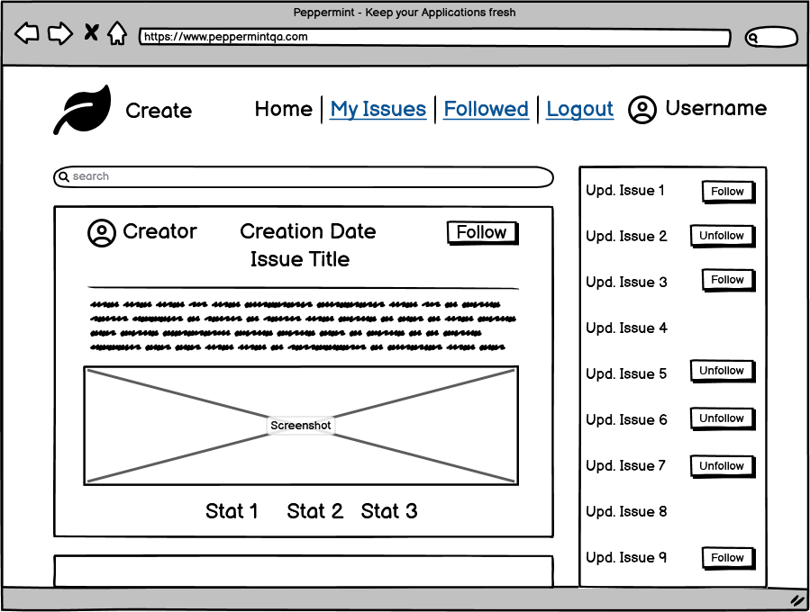
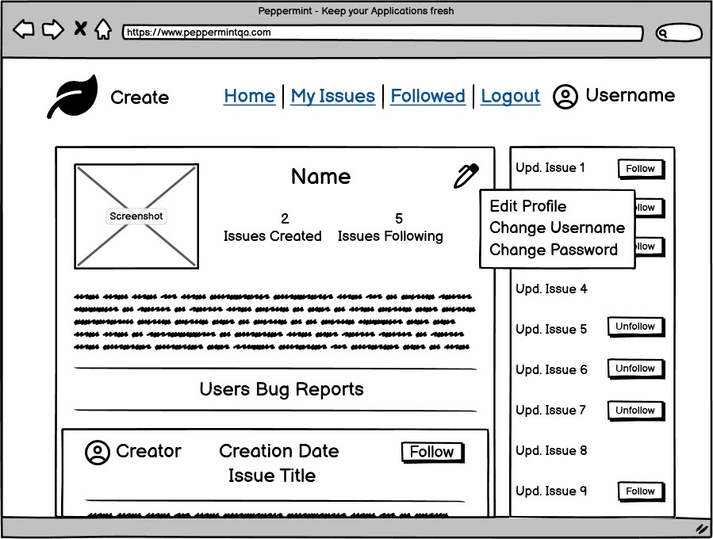

<h1 align="center"><a name="top">Project Peppermint</a></h1>

[View the live project here.](https://peppermint-qa.herokuapp.com/)

Project Peppermint is a Website that allows you to create Issues (also commonly referred to as Bug reports) and share them with other people. Authenticated users can create issues, update, and delete them. All Information is saved on an external API, which also tracks any modifications down to Events via its Journal model. 

Users can Browse and Search all Issues on the site and follow them, to more easily be updated on any changes to them. In addition, there is a box with the recent updated Issues that lets them easily see which issues were created/updated last and how many updates it has.

Contrary to my other Projects, this website is meant as an Intranet application, because of the nature of the shared information.

<h2 align="center"></h2>

 

## <a name="tableofcontents">Table of Contents</a>

### I. [User Experience (UX)](#userxp)
-   [Five Planes of UXD](#fiveplanes)
-   [Design](#design)
-   [User Stories](#userstories)
-   [Agile Methodology](#agile)
-   [Wireframes](#wireframes)

### II. [The Model](#databasemodel)

### III. [Features](#features)

### IV. [Technologies Used](#technology)

### V. [Testing](#testing)

### VI. [Future Features](#future)

### VII. [Deployment](#deployment)

### VIII. [Credits](#credits)

  

## ([^](#tableofcontents)) <a name="userxp">User Experience (UX)</a>

## <a name="userxp">User Experience (UX)]</a>

*   ### <a name="fiveplanes">Five Planes of UXD</a>
    -   #### Strategy Plane
        1. I've been working as a Customer Support Agent for 16 years and during that time I have come across a couple of different bug report/management systems. Most of them are overly complicated to use, so I wanted to create one that is more intuitive but still retains most of the functionality.
        2. Many companies do not need the bigger QA systems that are used with hundreds of features. A smaller lightweight application that is more fit for their needs will match their infrastructure better and reduce additional costs.
        3. Split between Frontend and Backend: By using an API, features can be implemented on the Backend and tested, without affecting Frontend functionality. This also makes it easier to split the development into different Teams, e.g. a Frontend and a Backend Team.
        4. Expandability: React is highly modular and can be easily expanded. If there is any need for more Features in the Future, they can be implemented without affecting the other components of the application. This also creates a situation where Teams working on the Frontend can be split further, each working on different components.
 
    -   #### Scope Plane
        1. The Site covers Authentication and CRUD around the Issues.
        2. Being logged in immediately is visible with the Username and a Profile Picture being displayed in the NavBar.
        3. The Page 'My Issues' is there to keep track of Issues created by the User as well as have easy access to deleting or modifying them.
        4. The Page 'Followed' is there to keep track of Issues being followed by the User.
        5. The Searchbar is there to easily filter Issues on the Home, My Issues and Followed Pages.
        6. Recently Updated Issues are shown in a Sidebar to easily access hot Issues.

    -   #### Structure Plane
        1. The Structure of the Site is simple and mostly linear. Progressing is mostly done with just the click of a Button unless form Inputs are required. The site visitor can always click on the navbar Elements to quickly find or create Issues when logged in.
        2. There is a clear indication on the Navbar when you are on one of it mentioned Pages. The only exceptions are the 'detail' and 'edit' Issue/Profile pages because these require a specific ID. However, these are straightforward and the site visitor can return to the normal navigation simply by clicking on one of the navbar elements.
    
    -   #### Skeleton Plane
        1. The [Wireframes](#wireframes) can be found further down in this Document.
        2. The Home Page is presented with a list of Issues, sorted by creation date.
        3. Issues are implemented as Cards throughout the whole page, being introduced on the Home Page and then followed up in My Issues and Followed.
        4. Forms are used for creating and modifying Issues, Login, and Register, as well as editing the User Profile.
        5. On mobile devices, the amount of content displayed next to each other changes to give users the chance to use the page with 100% functionality on these devices as well. The content is then ordered in a way he would normally consume the content on a Desktop Browser as well, to not cause confusion and keep it well structured. This is achieved by using Bootstrap 5.

    -   #### Surface Plane
        1. Fontawesome was used for the navbar and Dropdownmenues Anchor (Pen Symbol). Comparable Icons are used on other sites so this should feel familiar to the visitor.
        2. Further details like Font/Color choice, etc. can be found in the next separate Section: [Design](#design).

 

*   ### <a name="design">Design</a>
  
    -   #### Colour Scheme
        -   I choose a greenish color palette to match the leaf and keep the theme of "Peppermint". The Palette can be found [here](https://coolors.co/ffffff-008542-c5dbc2-cc2222-bec9c9-677979-000000).
        -   The Font Color used is Black (#000000) on White (#FFFFFF), for maximum readability.
        -   For the navbar, Icons are shown in Silver Sand (#BEC9C9) to better show the contrast of the highlight Spanish Green (#008542).
        -   To keep WCAG compliancy, all links are shown in Nickel(#677979), except for the Register and Login links on their respective Pages. These are shown in Lava (#CC2222), to highlight them as options if players went to the login page but want to register or vice versa. The same color is also used for highlighting Overdue Issues.
        -   The Background below the Navbar is painted in the final color, Cambridge Blue (#C5DBC2), which is a light shade of green.
    
     
    <h2></h2> 

    -   #### Typography
        -   The Oswald font is used as the main font for the whole website with sans-serif as a backup font in case the font doesn't import correctly.
        -   To complement this, Merriweather is used as the header/title font in most components. Its main purpose is to support the site's theme. The backup font is sans-serif as well.
  
    -   #### Imagery
        -   A green leaf (representing a Peppermint Leaf) is shown on the top left of the NavBar. It is also used as a Favicon for the Page.
        -   If a search returns no result, a warning Triangle with an "!" will be shown.
        -   When uploading an image, either for the Profile or an Issue, a Cloud Picture with an Arrow will be shown.
        -   Every Issue requires a screenshot/image for creation. These are resized to fit into the Issue Card.
        -   Users have the option to include a profile Picture which is then displayed as a circle on both their Profile Page and in the NavBar.

  
 

*   ### <a name="userstories">User stories</a>

    
    1. Authentication: Register - As a user, I can create a new account so that I can access all the features for registered users.
    2. Authentication: Login - As a user, I can login to the app so that I can access functionality for logged in users.
    3. Authentication: Authentication Status - As a user, I can tell if I am logged in or not so that I can log in if I need to.
    4. Authentication: Access Tokens - As a user, I can stay logged-in until I choose to log out so that I don't need to log back in after a couple of minutes.
    5. Authentication: Avatars - As a user, I can view user avatars so that I can easily identify them.
    6. Navigation: Conditional Rendering - As a logged out user, I can see login and register options so that I can login/register.
    7. Navigation: Navbar display - As a user, I can view a navbar from every page so that I can navigate easily between pages.
    8. Navigation: Routing - As a user, I can navigate through pages quickly so that I can view content seamlessly without page refresh.
    9. Navigation: Infinite Scroll - As a user, I can keep scrolling through the issues on the site, that are loaded for me automatically so that I don't have to click on a Pagination link to load more.
    10. Issues: Create Issue - As a logged in user I can create issues so that I can report bugs and errors.
    11. Issues: View Issue Detail - As a user, I can view the details of a single issue so that I can learn more about it.
    12. Issues: Most Recent Issues - As a user, I can view all the most recent issues, ordered by most recently updated first so that I am up to date with the newest bug reports.
    13. Issues: View own created Issues - As a logged in user, I can view content filtered by issues I created so that I can keep up to date with the development of these issues.
    14. Issues: View followed Issues - As a logged in user, I can view content filtered by issues I follow so that I can keep up to date with the development of these issues.
    15. Issues: Search Issues - As a user, I can search for issues with keywords, so that I can find the issues and users I am most interested in.
    16. Issues: Edit/Update Issues - As an issue creator/owner, I can edit/update my issue so that I can make corrections or update the issue after creating it.
    17. Issues: Journals - As a user, I can view journal entries so that I can see the most recent updates/modifications for an issue.
    18. Issues: Following/Unfollowing Issues - As a logged-in user, I can follow and unfollow issues so that I can add and remove issues from my following feed.
    19. Profiles: Profile Page - As a user, I can view other users' profiles so that I can see their posts and learn more about them.
    20. Profiles: User Stats - As a user, I can view the statistics of other users like the number of issues created and how many of them they are following so that I can learn more about them.
    21. Profiles: View all issues created by another User - As a user, I can view all issues a specific user has created so that I can see their latest contributions.
    22. Profiles: Edit Profile - As a logged-in user, I can edit my profile information so that I can update my Bio and Profile Picture.
    23. Profiles: Edit Username/Password - As a logged-in user, I can update my username and password so that I can change my displayed name and keep my profile secured.
    
    

 

*   ### <a name="agile">Agile Methodology</a>

    - The Development of this project was managed using GitHub Projects.
        1. [The Project](https://github.com/users/Mycrosys/projects/2/views/1?layout=board)
        2. Epics: [NAVIGATION](https://github.com/Mycrosys/portfolio-project-5-peppermint/issues/2), [AUTHENTICATION](https://github.com/Mycrosys/portfolio-project-5-peppermint/issues/1), [ISSUES](https://github.com/Mycrosys/portfolio-project-5-peppermint/issues/3), [PROFILES](https://github.com/Mycrosys/portfolio-project-5-peppermint/issues/5)
        3. User Stories: Please see above for [User Stories](#userstories).
    - Each Epic has the related User Stories written in its description. User Stories have their acceptance criteria written in their description.
    - For Epics to be marked as "done", each (non-optional) User Story needs to be finished as well.

 

*   ### <a name="wireframes">Wireframes</a>
    -   Home Page Wireframe - Logged out
        <h2></h2> 
    -   Home Page Wireframe - Logged in
        <h2></h2>
        The "My Issues" and "Followed" Pages look the same, they just pull different Issues (the one the User created and follows respectively).  
    -   Mobile Wireframe
        <h2></h2> 
    -   Register Page Wireframe
        <h2></h2> 
    -   Login Page Wireframe
        <h2></h2> 
    -   Issue Detail Page Wireframe 1
        <h2></h2> 
    -   Issue Detail Page Wireframe 2
        <h2></h2> 
    -   Create Bug Report Page Wireframe
        <h2></h2>
        The "Edit Issue" Page looks the same, it just prefills the fields with the existing Data of the Issue.  
    -   Profile Page Wireframe
        <h2></h2> 
    -   Edit Profile Page Wireframe
        <h2></h2> 
    -   Change Username Page Wireframe
        <h2></h2> 
    -   Change Password Page Wireframe
        <h2></h2> 
    
  

## ([^](#tableofcontents)) <a name="databasemodel">The Peppermint Database Model</a>

<h2></h2> 

- The implementation is done via an API. More Information and Details of the Models can be found in the README.MD of that Project: [QA API](https://github.com/Mycrosys/qa-api).
- The API handles all Authentication and uses dj-rest-auth (User Model).
- The Issue Model contains all relevant information about an issue.
- The Journals are used to store the history of an Issue. They contain which fields were changed and when.
- The Profile holds expanded User Information like the Bio and Profile Picture.
- The Following is used to keep track of which User is following which Issue.

  

## ([^](#tableofcontents)) <a name="features">Features</a>

###   Authentication

- The [QA API](https://github.com/Mycrosys/qa-api) handles all Authentication via Dj-rest-auth on the Website. Most of the Pages (my issues, followed, create/modify issues) require the User to be authenticated to work. If the User is not Authenticated, many elements of the Website aren't available, e.g. the Navbar does not even show some Pages, to begin with. If a User however uses a valid link to enter one of these pages, he will either get the same results of issues as the home page (for the lack of followed and my issues not having a user to get specific information) or be redirected to home (e.g. when trying to access the create issue page). On the other side, if a user is authenticated, other elements are not shown. For example, neither the Login nor Register button is available, but instead, a logout option, as well as the username, is displayed. If the User tries to access these Pages when he is logged in, he will also be redirected to the Home Page.

- The Navbar when you are logged out.
<h2></h2>

- The Navbar when you are logged in.
<h2></h2> 

###   Issue Creation/Modification/Deletion and Following

- Registered Site Users can create their Issues (Bug Reports) as well as modify or delete them. For easier access to created issues, my issues page exists, showing all events that the user created. In addition, the Followed Page allows Users to keep track of Issues they are following. Following is as easy as clicking a Button in either the Recently Updated Issues Sidebar or on the Top Right of an Issue. Users can not follow Issues they created themselves.

<h2></h2> 

###   Recently Updated Issues

- A Sidebar on the Website provides a quick overview of recently created and updated Issues. This way, Users can stay up to date with Issues that are regularly updated and new Issues appearing that may be relevant to what they are working on. Both the number of modifications (journals) and the time of the last update are shown here. They can also follow/unfollow these Issues with a quick click of a Button.

<h2></h2> 

###   Dropdown Menus

- Modifications like editing an Issue or settings in the User Profile can be done by clicking the Pen Icon. This will open a simple Dropdown Menu that offers options like Delete/Edit (for Issues) or Edit Profile/Change Username/Change Password in the Users Profile.

- The Dropdown Menu for Issues
<h2></h2> 

- The Dropdown Menu for Profiles
<h2></h2> 

###   Journals

- The [QA API](https://github.com/Mycrosys/qa-api) creates a Journal each time an Issue receives a modification. These are then shown below the Detail View of each Issue with a Timestamp of when it was created. This creates a nice history of modifications for each Issue that can be helpful for developers.

<h2></h2> 

###   Infinite Scroll

- The Site automatically keeps loading Issues and Journal entries when the User scrolls down. There is no need to hit a "next page" button. This creates a much better User experience and keeps website visitors engaged with the content.

 

## ([^](#tableofcontents)) <a name="technology">Technologies Used</a>

### Languages Used

-   [HTML 5](https://en.wikipedia.org/wiki/HTML/)
-   [CSS 3](https://en.wikipedia.org/wiki/CSS)
-   [JavaScript](https://de.wikipedia.org/wiki/JavaScript)
-   [ReactJS](https://en.wikipedia.org/wiki/React_(JavaScript_library))

### Frameworks, Libraries & Programs Used

1. [QA API](https://github.com/Mycrosys/qa-api)
    - For handling all Data including Authentication
1. [Code Institute Template:](https://github.com/Code-Institute-Org/cra-template-moments)
    - This Template was used as a requirement for this React Project.
1. [Git](https://git-scm.com/)
    - Git was used for version control by utilizing the Gitpod terminal to commit to Git and Push to GitHub.
1. [GitHub:](https://github.com/)
    - GitHub is used to store the project's code after being pushed from Git.
1. [Google Fonts:](https://fonts.google.com/)
    - Google fonts were used to import the 'Oswald' and 'Merriweather' fonts into the style.css file.
1. [Font Awesome:](https://fontawesome.com/)
    - Font Awesome was used to add icons for aesthetic and UX purposes.
1. [Bootstrap](https://getbootstrap.com/)
    - Used to make the Website responsive and style it.
1. [Axios](https://axios-http.com/docs/intro)
    - For making API requests.
1. [JWT Decode](https://jwt.io/)
    - For Decoding JSON Web Tokens.
1. [React Router](https://reactrouter.com/en/main)
    - For routing of the Website.
1. [moment.js](https://momentjs.com/)
    - For converting the Date/Time from the API into a format that can be used in forms.
1. [Infinite Scroll](https://infinite-scroll.com/)
    - For automatically loading new issues and journal entries without the need for pagination.
1. [Mock Service Worker](https://mswjs.io/)
    - For automatical testing of React Components.
1. [Heroku](https://www.heroku.com/)
    - For deployment of the Project
1. [Balsamiq](https://balsamiq.com/)
    - Balsamiq was used to create [Wireframes](#wireframes) for the project.
1. [Gimp:](https://www.gimp.org/)
    - Gimp was used to create, modify and resize all images on this website.
1. [W3C - HTML](https://validator.w3.org/)
    - For validating the HTML code
1. [W3C - CSS](https://jigsaw.w3.org/css-validator/)
    - For validating the CSS Code
1. [a11y](https://color.a11y.com/Contrast/)
    - For validating the contrast of colors used on the Website

 

## ([^](#tableofcontents)) <a name="testing">Testing</a>

### General Testing

1. The W3C Markup Validator and W3C CSS Validator Services were used to validate every page of the project to ensure there were no syntax errors in the project.
    - [W3C Markup Validator](https://validator.w3.org/#validate_by_input) - [Results](https://validator.w3.org/nu/?doc=https%3A%2F%2Fpeppermint-qa.herokuapp.com%2F)
    - Because most of the Websites Content was not available to test because it required validation, the Site Code (browser -> show source code)was instead put into the Markup Validator to confirm every site runs through it without error. No errors have been found and all Pages returned the same result as the home page.
    - [W3C CSS Validator](https://jigsaw.w3.org/css-validator/#validate_by_input) - As with the HTML Validator above, checks were done via Direct Input. All checks returned no Errors.
    <h2></h2> 

2. The JSHINT Validator can NOT be used to validate React JS Code. Please see the automatic Testing further below.

3. Contrast and WCAG: [a11y](https://color.a11y.com/Contrast/) was used to check for WCAG compliance to maximize Accessibility.
<h2></h2>

4. Resolution and Scaling were tested with Google Dev tools down to the lowest width device (Galaxy Fold, 280px) to ensure the website works on all resolutions 280px and above. It is however recommended, that devices used have at least a width of 360px for an optimal viewing experience.

5. The Website was viewed on the following Devices:
    - Windows 10 PC
    - Google Pixel 6
    - Apple Ipad (5th generation)
      
    Both the Pixel 6 and Apple Ipad displayed the site perfectly in normal and Landscape mode on Google Chrome. In addition, the Website was viewed on PC on Google Chrome, Mozilla Firefox, Opera Brave, and Microsoft Edge. The site looked and worked great on all Devices and all Browsers Used.
 

### Google Lighthouse Testing

1. Results
- Desktop of Index Page:
  <h2></h2> 
- Mobile of Index Page:
  <h2></h2> 
- Desktop of My Events Page:
  <h2></h2> 
- Mobile of My Events Page:
  <h2></h2> 
- Performance on Mobile Devices is low, due to the use of Pictures in all Issues. Once we take Desktop Devices into account, Performance is pretty good though. We do however see Best Practices drop to 92 on the Home Page. This is related to one of the Pictures used being low res and the image is stretched to match the width of the Card. Depending on what resolution Images are being uploaded, Performance and Best Practices may drop, but that is something that sadly can not be changed unless we remove all pictures, which is not a valid option for this Project. Best Practices return to 100 on the My Issues Page, because the Pictures used are of a higher resolution and therefore aren't stretched.

 

### Automated Testing (with Mock Service Worker)

1. A total of 3 automatic tests were written to test the NavBar. These are the same tests done in the Moments Walkthrough Project. This is more proof that I know how to set up and code React JS Testing because Time constraints did not allow me to write tests for all components. By the time I turn in this Project, I already spent ~7 weeks on it. If I had unlimited time or were more accustomed to React and Work faster, this would be the next thing I spend my time with - especially because it might have helped me resolve some of the Known Issues mentioned further below.
    - Is the NavBar rendering correctly?
    - Do logged-in Users have a Profile Link with their Username?
    - Do logged-out Users have a login and register link?
    
2. The Tests are run by typing "npm test" in the Terminal.
3. Results: <h2></h2>

 

### Known Issues
- While the Follow/Unfollow Buttons are Updated on the fly in the Recently Updated Issues, the Button is not Updated in the Issues until a manual reload is done. If you try to unfollow an already unfollowed issue again in this way, you will get a 404 API Error. This does however not hinder the Follow/Unfollow functionality. <h2></h2>
- Creating a new Issue or modifying one, does not Update the list of Recently Updated Issues until a manual reload is done. These 2 Issues were Troubleshot for many hours (~10h and an additional 5 with Tutor Support), without them being resolved. In the end, the Code was rolled back to a state that does not create Errors when Browsing the Site normally.
- Editing an Issue will create a deprecation warning from moment.js. This is just a warning of a third-party Library, but in Case the Due Date is no longer prefilled due to this, another solution needs to be found.
  <h2></h2>
  

## ([^](#tableofcontents)) <a name="future">Future Features</a>

1. Custom User Model: Implementing a Custom User Model is a necessary step to making different levels of Users, e.g. normal users, developers, supervisors, and leads. This would give the option for everyone to report Bugs, but the assignment of an issue would only be done by a supervisor/lead to a developer. This creates a scenario, where an app user can report a bug to customer support, customer support enters the bug on the Peppermint Page, and a supervisor assigns the Issue to a Developer. Without this, assigning an Issue wouldn't make a lot of sense, because the creator of the Issue would, in most cases, not be the one qualified to select someone to assign it to and a supervisor wouldn't enter the bug into the App by himself.
2. Assigning an Issue to multiple Users: The API does already support this, but unless a Custom User Model is implemented, it wouldn't make a lot of sense to implement this. This would split the workload nicely between different kinds of Users.
3. Claiming an Issue: Another possibility would be an option to either claim a specific Issue manually (e.g. a Developer assigns an Issue to himself) or a System by which a Developer draws the next issue that is unassigned and needs attention. There may be a need here for further specifications of an Issue, e.g. UI/Gameplay/Sound, etc, so a Developer mainly working on Sound issues don't end up with an Issue he is less accustomed to.
4. Daily/Weekly Stats: This would require a profile to have an email set. A weekly report of actions done on both worked-on Issues and Followed Issues could be implemented. Stats are important in this kind of work. This could also be implemented for a supervisor/lead to check regularly for productivity.

  

## ([^](#tableofcontents)) <a name="deployment">Deployment</a>

## Creating a React app

1. Create a new Repository in Github by clicking the "New" Button right next to it.
1. Give your repository a name and choose "No Template".
1. Click the "Gitpod" Button to create an empty workspace.
1. Create a react app by using the Code Institute moment template with the command "npx create-react-app . --template git+https://github.com/Code-Institute-Org/cra-template-moments.git --use-npm"
1. Press y to confirm installing the packages. This will install all dependencies. Wait until all of them are installed.
1. You can start your Server with "npm start" and check if everything runs fine.
1. You should now see the basic deployment welcome page of React.

## Deployment on Heroku

1. Log in to [Heroku](https://www.heroku.com)
1. When you see your Dashboard, click on "New" and select "Create New App"
1. Enter the App name and select your region then click on "Create App"
1. On the Top Nav now select "Deploy". Select GitHub as the deployment option and connect to your GitHub repository. Search for your repository name and click on the "connect" button.
1. At the bottom of the page, you will be able to choose between automatic and manual deployment. Choose your preferred method.

## Finalizing Deployment 

1. You have to first install the [QA API](https://github.com/Mycrosys/qa-api) and deploy it. Please copy the link of the deployed API.
1. In src/api/axiosDefaults.js, copy the link next to "axios.defaults.baseURL =" with singlequotes next to it, e.g. "axios.defaults.baseURL = 'https://mydeployedapi.herokuapp.com/';". Do not forget the ";" at the end of it.
1. This is to connect to the API and is mandatory for the Project to work.
1. Create a Procfile with one line of content: "web: serve -s build".
1. Deploy the final Code on Heroku

### Forking the GitHub Repository

- By forking the GitHub Repository we make a copy of the original repository on our GitHub account to view and/or make changes without affecting the original repository by using the following steps:

1. Log in to GitHub and locate the [GitHub Repository](https://github.com/Mycrosys/portfolio-project-5-peppermint)
1. At the top of the Repository (not the top of the page) just above the "Settings" button on the menu, locate the "Fork" button.
1. You should now have a copy of the original repository in your GitHub account.

### Making a Local Clone

1. Log in to GitHub and locate the [GitHub Repository](https://github.com/Mycrosys/portfolio-project-5-peppermint)
1. Under the repository name, click "Clone or download".
1. To clone the repository using HTTPS, under "Clone with HTTPS", copy the link.
1. Open Git Bash
1. Change the current working directory to the location where you want the cloned directory to be made.
1. Type "git clone", and then paste the URL you copied in Step 3.
1. Press Enter. Your local clone will be created.

Click [Here](https://help.github.com/en/github/creating-cloning-and-archiving-repositories/cloning-a-repository#cloning-a-repository-to-github-desktop) to retrieve pictures of some of the buttons and more detailed explanations of the above process.

 

## ([^](#tableofcontents)) <a name="credits">Credits</a>

### Framework

- The Template that was used during the installation belongs to [Code Institute](https://codeinstitute.net/global/) and can be found [here](https://github.com/Code-Institute-Org/cra-template-moments).

### Readme

-   The Basic Structure of the Readme was taken from [Code Institute's Sample Readme](https://github.com/Code-Institute-Solutions/SampleREADME/blob/master/README.md).

### Media

- All images used in this Project are royalty free for Commercial Use.

- The [Leaf Logo](https://www.freepik.com/free-vector/mint-leaf-logo-business-branding-template-designs-inspiration-isolated-white-background_22214290.htm#query=mint%20logo&position=1&from_view=keyword) was created by [Wangstdo](https://www.freepik.com/author/wangstdo) and comes from [Freepik](https://www.freepik.com/).

- The [Traffic Sign](https://pixabay.com/vectors/traffic-sign-attention-road-sign-38589/) was created by [Clker-Free-Vector-Images](https://pixabay.com/users/clker-free-vector-images-3736/) and comes from [Pixabay](https://pixabay.com/).

- The [Cloud Upload Icon](http://simpleicon.com/cloud-upload-2.html) is a by me modified version of a picture found on [Simple Icon](http://simpleicon.com/).

- The Sites Favicon next to the Websites Name in the Tab was created by me with the use of the above-mentioned Leaf Logo and Gimp.

### Code

- Because this was my first React Project, part of the CSS and ReactJS code was taken from the Walkthrough Projects "Moments" to have a working baseline. Throughout the project, that code was modified so that it fits the intended purpose of a QA Application. However, some parts of the Code may still be similar or identical (Asset, Avatar, MoreDropDown, Hooks, etc.). During the creation of this Project, I heavily followed the way implementations was made in the Moment Walkthrough Projects, as can be seen by the commits. The same can be said about the way the components are structured throughout the Project.

### Acknowledgments

-   My Mentor for continuous helpful feedback.
-   Tutor Support for their help when I was stuck. Honestly, thank you so much.
-   My Peers in Code Institute's Slack channel for their feedback.
